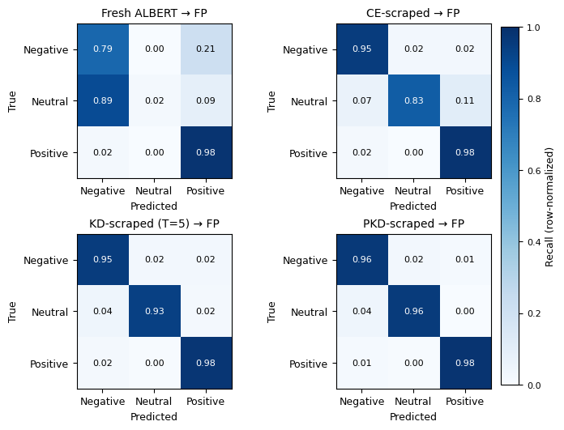

# Efficient Financial Sentiment Modeling via Knowledge Distillation

**TL;DR:** Patient Knowledge Distillation (PKD) transfers FinBERT’s financial
sentiment capability to a compact ALBERT model, achieving **0.9626 macro-F1**
on Financial PhraseBank with **>10× model compression** and no inference
slowdown.

This repository presents an empirical study on transferring financial sentiment
classification capability from a large **FinBERT** teacher model to a compact
**ALBERT** student using **Knowledge Distillation (KD)** and
**Patient Knowledge Distillation (PKD)**.

The goal is to achieve **near-teacher performance** while significantly reducing
model size, enabling efficient deployment in resource-constrained settings.

---

## Overview

- **Teacher:** ProsusAI/finbert  
- **Student:** albert-base-v2  
- **Task:** 3-class financial sentiment classification  
  (negative / neutral / positive)  
- **Datasets:**
  - Pseudo-labeled scraped financial news (teacher supervision)
  - Financial PhraseBank (100% agreement subset)

---

## Training Pipeline

1. **Pseudo-Label Generation**  
   FinBERT is used as a frozen teacher to generate hard and soft labels
   on scraped financial news.

2. **Stage 1 – Pretraining on Pseudo-Labeled Data**  
   ALBERT students are trained using:
   - Cross-Entropy (CE)
   - Vanilla Knowledge Distillation (KD) with temperature \(T \in \{2,5,9\}\)
   - Patient Knowledge Distillation (PKD) with intermediate representation alignment

3. **Stage 2 – Fine-Tuning on Financial PhraseBank**  
   All pretrained students, along with a fresh ALBERT baseline,
   are fine-tuned for one epoch under identical optimization settings.

---

## Key Results (Financial PhraseBank – Test Set)

| Model | Test Accuracy | Test Macro-F1 |
|------|---------------|---------------|
| Fresh ALBERT → FP | 0.8029 | 0.5544 |
| CE-scraped → FP | 0.9529 | 0.9313 |
| KD-scraped (T = 5) → FP | 0.9647 | 0.9525 |
| **PKD-scraped → FP** | **0.9735** | **0.9626** |
| FinBERT (Teacher) | 0.9765 | 0.9500 |

**PKD-scraped → FP** achieves the strongest performance among student models,
closely matching FinBERT while using a much smaller architecture.

All numerical results reported above are available as CSV/JSON files in
the `results/` directory for transparency and reuse.

---

## Confusion Matrix Analysis

The figure below compares row-normalized confusion matrices on the
Financial PhraseBank test set for four models:
Fresh ALBERT, CE-scraped, KD-scraped (T = 5), and PKD-scraped.

PKD yields the most balanced predictions across all sentiment classes,
particularly improving recall for the minority *neutral* class.

---

## Efficiency and Compression

- **FinBERT:** 109.5M parameters (~417.7 MB)  
- **ALBERT students:** 11.7M parameters (~44.6 MB)  
- **Compression:** >10× reduction in model size  

Despite similar inference latency per document across ALBERT variants,
knowledge distillation substantially improves predictive performance **without
any increase in inference cost**, making PKD particularly attractive for
deployment under tight resource constraints.

---

### Inference Throughput (Financial PhraseBank)

Despite being over 10× smaller, ALBERT-based students exhibit similar
per-document inference latency across training strategies
(~2.0 ms/doc, ~490 docs/s). Knowledge distillation improves predictive
performance without affecting inference speed.

Interestingly, FinBERT achieves faster per-document inference
(1.49 ms/doc, 671.8 docs/s), reflecting architectural and implementation
optimizations in the teacher model rather than parameter count alone.

---

## Knowledge Transfer Diagnostics

We analyze the effectiveness of distillation by measuring the average
Kullback–Leibler (KL) divergence between teacher and student output
distributions on the Financial PhraseBank test set.

Lower KL values indicate closer alignment with the teacher.

| Model | Avg. KL (Teacher \|\| Student) |
|------|-------------------------------|
| Fresh → FP | 0.3418 |
| CE-scraped → FP | 0.2334 |
| KD-scraped → FP | 0.1427 |
| **PKD-scraped → FP** | **0.1339** |

PKD produces the closest alignment with FinBERT, confirming more effective
knowledge transfer beyond hard-label supervision.

---

## Repository Structure

- `notebooks/` — Original Colab notebook containing all experiments  
- `assets/` — Figures and visualizations  
- `results/` — Precomputed metrics and result tables  
- `configs/` — Experiment configuration summaries  

---

## Note on Reproducibility

The repository provides configuration summaries and result artifacts.
Scripts for reproducing experiments can be added incrementally; the
original end-to-end experimental pipeline is fully documented in
`notebooks/pipeline.ipynb`.